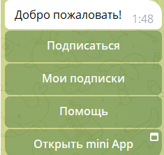
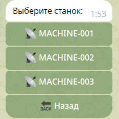
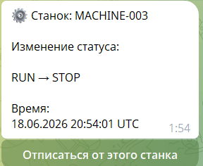
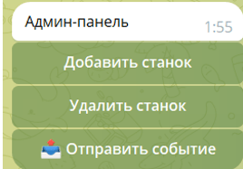
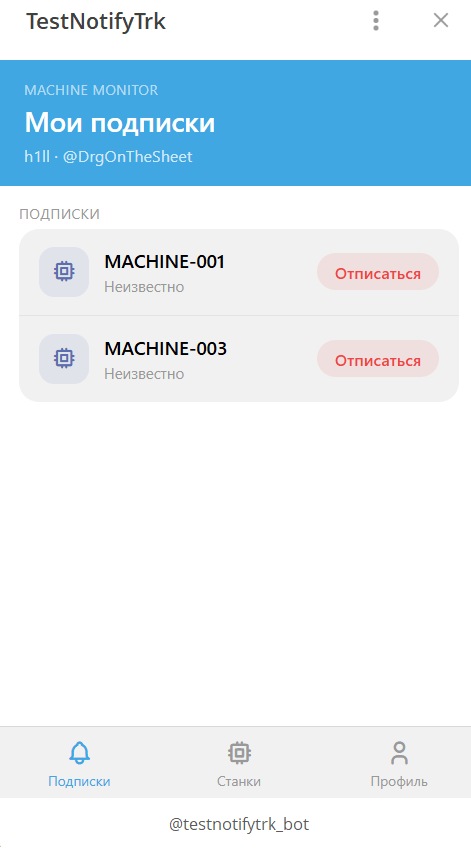

<div align="center">

# 🤖 DemoBotTelega

**Telegram-бот для мониторинга статусов производственных станков**

[](https://openjdk.org/)
[](https://spring.io/projects/spring-boot)
[](https://kafka.apache.org/)
[](https://www.postgresql.org/)
[](https://core.telegram.org/bots/api)
[](LICENSE)

Пользователи подписываются на станки и мгновенно получают уведомления в Telegram и на email при изменении их статуса. Администраторы управляют станками и вручную публикуют события через удобный inline-интерфейс прямо в боте.

</div>

---

## 📸 Скриншоты

| Главное меню | Выбор станка | Уведомление |
|:---:|:---:|:---:|
|  |  |  |

| Админ-панель | Mini App |
|:---:|:---:|
|  |  |

---

## ✨ Возможности

- 📡 **Подписка на станки** — через inline-меню или текстовые команды
- 🔔 **Уведомления** — в Telegram и на email при смене статуса
- 🌍 **Мультиязычность** — интерфейс на русском, английском и нидерландском
- 🖥 **Telegram Mini App** — полноценный веб-интерфейс внутри Telegram
- 🔧 **Админ-панель** — добавление/удаление станков, ручная публикация событий
- ⚡ **Apache Kafka** — асинхронная event-driven обработка событий

---

## 🏗 Архитектура

```
Пользователь Telegram
       │
       ▼
 MachineBot  ──────────────────────────────────────┐
 (Long Polling)                                    │
       │                                           ▼
       ├── Handlers              REST API /api/webapp/*
       │   (callbacks, команды)  (Telegram Mini App)
       │                                │
       └── Services          TelegramWebAppAuthService
                              (HMAC-SHA256 валидация initData)


Администратор → /event → AdminEventFlowHandler
                                │
                                ▼
                     MachineEventProducer
                                │
                   [Kafka: machine-status-events]
                                │
                                ▼
                     MachineEventConsumer
                                │
                                ▼
                     MachineEventService
                     ├── 📨 Telegram-уведомление подписчикам
                     └── 📧 Email-уведомление (если email задан)
```

---

## 🛠 Стек технологий

| Слой | Технология |
|---|---|
| Язык | Java 26 |
| Фреймворк | Spring Boot 4.0.6 |
| База данных | PostgreSQL + Spring Data JPA |
| Брокер сообщений | Apache Kafka |
| Telegram API | TelegramBots 6.8.0 |
| Email | Spring Mail (Gmail SMTP) |
| Frontend (Mini App) | HTML / Vanilla JS |

---

## 📁 Структура проекта

```
src/main/java/com/example/demo/
├── bot/            # Основной класс бота (MachineBot)
├── config/         # Конфигурация Kafka, MessageSource
├── controller/     # REST-контроллеры (Mini App, Admin)
├── dto/            # DTO объекты
├── entity/         # JPA-сущности: Subscriber, Machine, MachineSubscription
├── handler/        # Обработчики команд и callback-кнопок
├── machine/        # MachineStatus enum, MachineStatusChangeEvent record
├── repo/           # Spring Data JPA репозитории
└── service/        # Бизнес-логика
```

---

## 🚦 Статусы станков

| Статус | Описание |
|---|---|
| `RUN` | ▶ Станок работает |
| `STOP` | ⏹ Станок остановлен |
| `CONNECTION_LOST` | ❌ Потеряно соединение |

---

## 💬 Команды бота

### Пользовательские

| Команда | Описание |
|---|---|
| `/start` | Регистрация и главное меню |
| `/subscribe <id>` | Подписаться на станок |
| `/unsubscribe <id>` | Отписаться от станка |
| `/list` | Список моих подписок |
| `/setemail <email>` | Сохранить email для уведомлений |
| `/lang` | Сменить язык интерфейса |
| `/myid` | Узнать свой chat ID |

### Административные

| Команда | Описание |
|---|---|
| `/admin` | Открыть админ-панель |
| `/event` | Отправить событие о смене статуса станка |

---

## 🚀 Запуск локально

### Предварительные требования

- Java 26+
- PostgreSQL
- Apache Kafka
- Telegram-бот (создать через [@BotFather](https://t.me/BotFather))

### 1. Клонировать репозиторий

```bash
git clone https://github.com/ВАШ_НИК/DemoBotTelega.git
cd DemoBotTelega/DemoBotTelega
```

### 2. Настроить переменные окружения

Скопируй `.env.properties.example` в `.env.properties` и заполни значения:

```properties
DB_URL=jdbc:postgresql://localhost:5432/notify_machine
DB_USERNAME=postgres
DB_PASSWORD=your_db_password

TELEGRAM_BOT_USERNAME=YourBotUsername
TELEGRAM_BOT_TOKEN=your_telegram_bot_token

MAIL_USERNAME=your_email@gmail.com
MAIL_PASSWORD=your_gmail_app_password    # App Password, не обычный пароль
```

> 💡 Для Gmail нужен [App Password](https://myaccount.google.com/apppasswords) — обычный пароль не подойдёт.

### 3. Создать базу данных

```sql
CREATE DATABASE notify_machine;
```

Схема создаётся автоматически при первом запуске (`ddl-auto=update`).

### 4. Запустить Kafka

```bash
# Docker (быстрый способ):
docker run -d -p 9092:9092 apache/kafka:latest
```

### 5. Запустить приложение

```bash
./mvnw spring-boot:run
```

---

## 🔌 REST API (Mini App)

Все эндпоинты требуют заголовок `X-Init-Data` с Telegram `initData`.  
Подпись валидируется по алгоритму HMAC-SHA256 согласно [официальной документации Telegram](https://core.telegram.org/bots/webapps#validating-data-received-via-the-mini-app).

| Метод | Путь | Описание |
|---|---|---|
| `POST` | `/api/webapp/auth` | Валидация initData, возврат данных пользователя |
| `GET` | `/api/webapp/me` | Данные текущего авторизованного пользователя |
| `GET` | `/api/webapp/machines` | Все станки с флагом подписки |
| `GET` | `/api/webapp/my-subscriptions` | Только мои подписки |
| `POST` | `/api/webapp/subscribe/{machineId}` | Подписаться на станок |
| `POST` | `/api/webapp/unsubscribe/{machineId}` | Отписаться от станка |
| `POST` | `/api/webapp/set-email` | Сохранить email (`{"email": "..."}`) |

---

## 👤 Добавление администратора

Администраторы хранятся в таблице `admin`. Добавить через SQL:

```sql
INSERT INTO admin (chat_id) VALUES (ВАШ_CHAT_ID);
```

Свой `chat_id` можно узнать командой `/myid` в боте.

---

## 🌍 Локализация

| Язык | Файл |
|---|---|
| Русский (по умолчанию) | `messages_ru.properties` |
| English | `messages_en.properties` |
| Nederlands | `messages_nl.properties` |

Язык определяется автоматически при `/start` по настройкам Telegram пользователя. Изменить вручную — командой `/lang`.

---

## 📄 Лицензия

Распространяется под лицензией [MIT](LICENSE).
